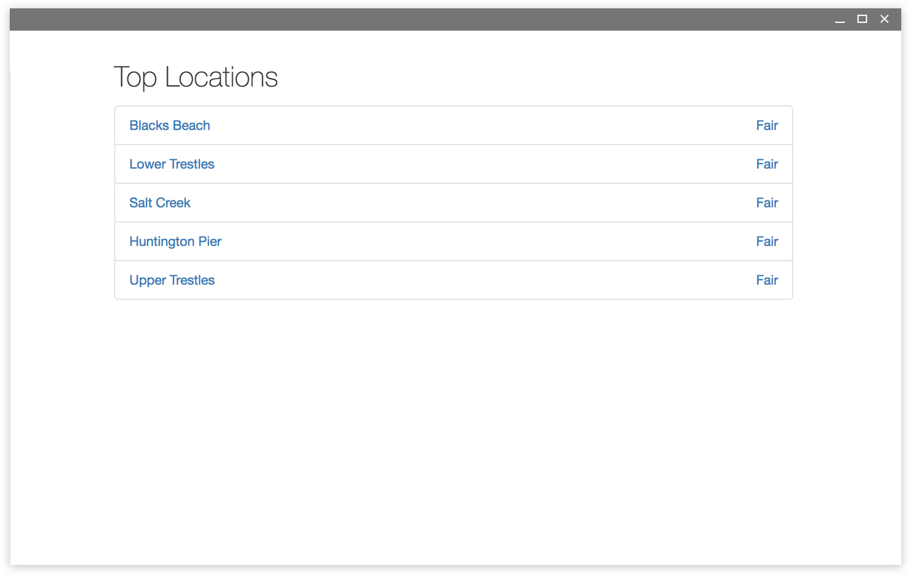
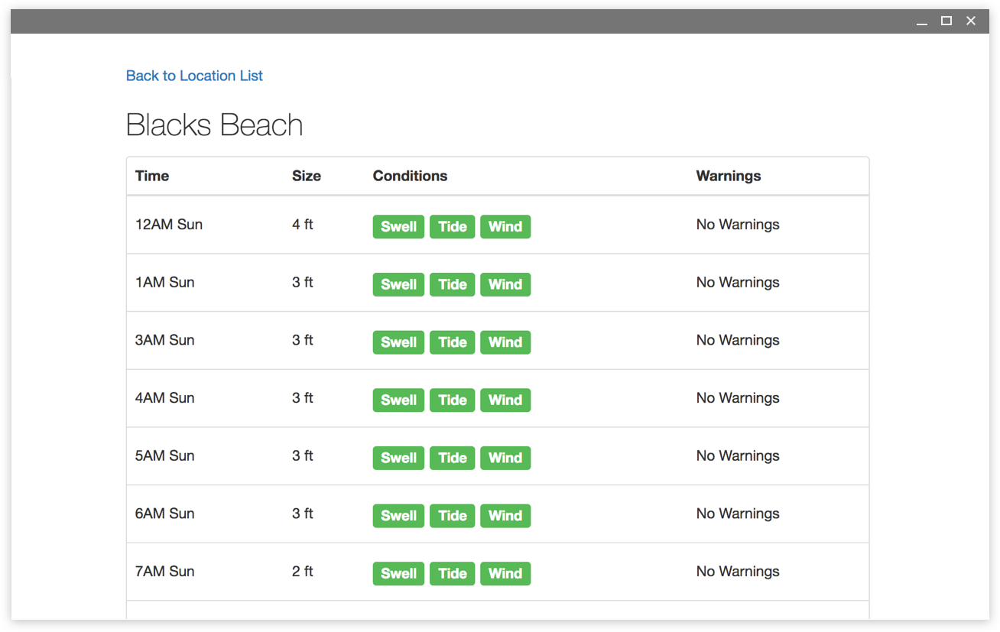

# Surf Finder

[](https://travis-ci.org/ryanbozarth/surf-finder)

http://ruthless-heat.surge.sh/

## Introduction
Surf Finder is the easeast way to get a 2-day forecast for the best breaks in California. It uses the [Spitcast API](http://api.spitcast.com/api/docs/) to show swell height, key conditions, and any warnings that you should know.

Know before you go.





## Documentation

If you would like to try running it yourself:

```
$ npm install
$ npm start
```

## Packages and Other Technology Used

- React / React Router
- Redux
- Mocha
- Webpack
- Axios
- Babel
- Travis
